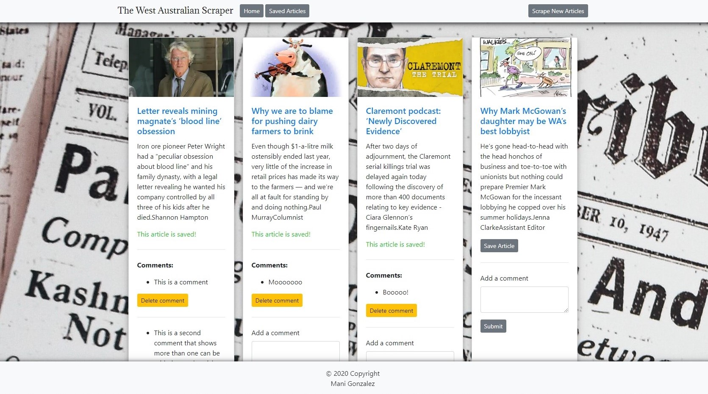
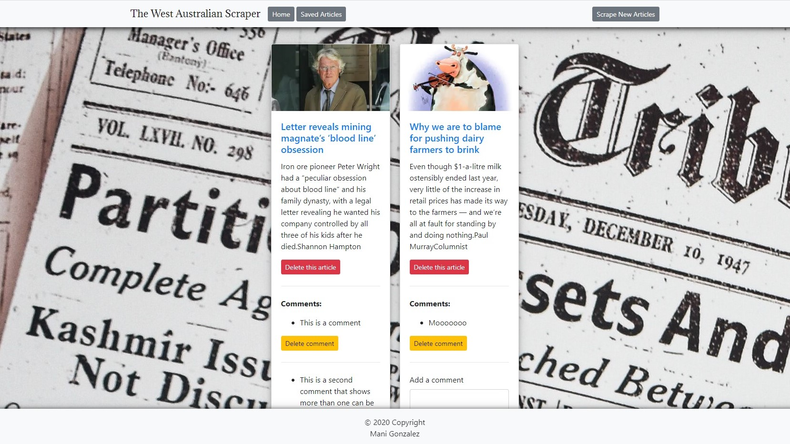

# West OZ Scraper

> ### Scrapes the West Australian news website
>
> _Add/Delete multiple comments on each scraped article._  
> _Save articles to the Database._  
> _View all saved articles on the saved articles page._  
> _Remove articles from the database and savedarticles page._

## Click <a href="https://west-oz-scraper.herokuapp.com" target="_blank" > here</a> to see the live app.

This is the Home Page:

This is the Saved Articles Page:

## Build Features

- Bootstrap/Handlebars front end.
- Node Express Web Server.
- mongoDB back end.
- Folder structure that meets MVC Paradigm.
- DELETE, GET, POST and PUT routes for retrieving and adding new data.
- AJAX - DELETE, PUT and POST requests.
- Deployed to Heroku <a href="https://west-oz-scraper.herokuapp.com" target="_blank">**West OZ Scraper**</a>.
- No Exposed sensitive keys.

## Dependencies:

- axios
- cheerio
- express
- express-handlebars
- mongoose
- morgan

## Local Setup:

- Clone this repo to your local machine.
- run npm install
- open your browser and enter ( localhost:3000/ ) without the brackets in the address bar.

Thank you for visiting!
